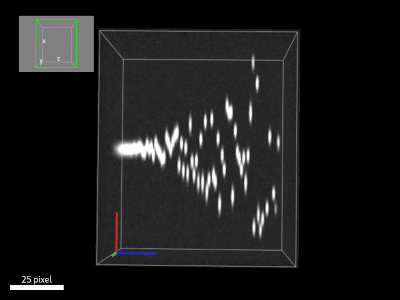

### Beating "cilia" filament simulations
---
A set of ImageJ macros that simulates volumetric undulating   
beating of a "cilia" filament in 3D and time.

The first script [01_flexrod_.ijm](https://github.com/ekatrukha/beating_filament_simulation/blob/main/01_flexrod_.ijm) simulates "ground truth" data,  
the output should look something like this.

The second script [02_timeslice_.ijm](https://github.com/ekatrukha/beating_filament_simulation/blob/main/02_timeslice_.ijm) uses generated "ground truth" data,  
and outputs "acquisition", where "microscope"  
records first z-slice of the volume over time,  
then the second z-slice over time, etc.  
It should look something like this:

The last, third script [03_volumeovertime.ijm](https://github.com/ekatrukha/beating_filament_simulation/blob/main/03_volumeovertime.ijm) uses generated "ground truth" data,  
and outputs "acquisition", where "microscope"   
performs volumetric scans over time.  

